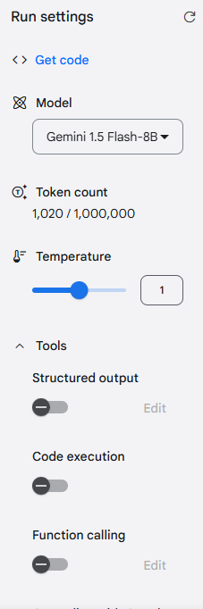

## Prompt Engineering

https://scrimba.com/intro-to-ai-engineering-c032

## Gemini

### Gemini Studio

https://aistudio.google.com/u/1/apikey (the key will be the same for any model you use)

https://ai.google.dev/gemini-api/docs/api-key#windows

The example code in Gemini Studio RUNS ONLY ON Linux / Unix (MS 'curl' has different naming for arguments!!!)

```bash
curl "https://generativelanguage.googleapis.com/v1beta/models/gemini-1.5-flash-8b:generateContent?key=GEMINIAPIKEY" -H 'Content-Type: application/json' -X POST -d '{"contents": [{"parts":[{"text": "Explain how AI works"}]}]}'
```

#### Testing our possible evaluation prompt

It might take some parsing...

"Is the following promt pentagram-compliant?\n'You are a friendly customer service representative for a leading tech company. The response will be used as part of a troubleshooting guide. Write an email explaining the benefits of upgrading to a premium subscription. Provide a detailed list of items in a CSV format.'\nAssume all the components should be explicitly declared, don't accept if any component is implicit.\nIf there is a missing or wrong pentagram component in that prompt, provide a report in HTML. The report should looks like following:\n<p><strong>Missing Components:</strong></p><ul><li><strong>Persona:</strong><p>Who should the AI be acting as? (e.g., an expert in AI prompting, a teacher, etc.)</p></li><li><strong>Output:</strong><p>What specific format or style is desired? (e.g., a step-by-step guide, a concise summary, etc.)</p></li><li><strong>Constraints:</strong><p>Are there any limitations on the explanation? (e.g., avoid technical jargon, keep it brief, etc.)</p></li></ul>"

```bash
curl "https://generativelanguage.googleapis.com/v1beta/models/gemini-1.5-flash-8b:generateContent?key=GEMINIAPIKEY" -H 'Content-Type: application/json' -X POST -d '{"contents": [{"parts":[{"text": "Is the following promt pentagram-compliant?:\n >> You are a friendly customer service representative for a leading tech company. The response will be used as part of a troubleshooting guide. Write an email explaining the benefits of upgrading to a premium subscription. Provide a detailed list of items in a CSV format. <<\nAssume all the components should be explicitly declared, do not accept if any component is implicit. If there is a missing or wrong pentagram component in the prompt provide a report in HTML format."}]}]}'
```

Best unicode (hex) decoder for the response in HTML: https://magictool.ai/tool/unicode-decoder-encoder/

### Quick Start

https://ai.google.dev/gemini-api/docs/quickstart

### API Key Security

https://www.youtube.com/watch?v=Od7YwGqBik8&t
https://stackoverflow.com/questions/37482366/is-it-safe-to-expose-firebase-apikey-to-the-public

### References and Learning Resources

https://github.com/chingu-voyages/V54-tier1-team-01/issues/16

https://googleapis.github.io/js-genai/

https://www.youtube.com/watch?v=nCEsIbfoLJM

## Additional Considerations

### Prompts resident on the app??? ==> chat

https://aistudio.google.com/app/prompts

### Cost metrics

